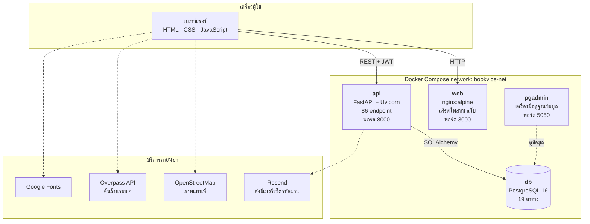
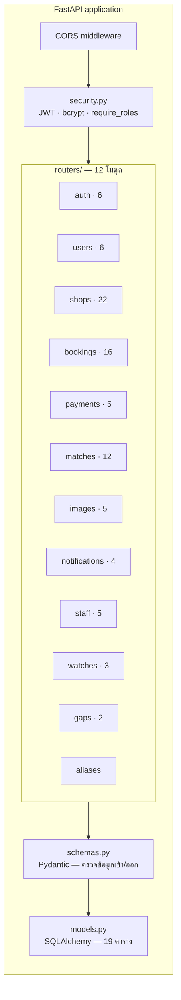
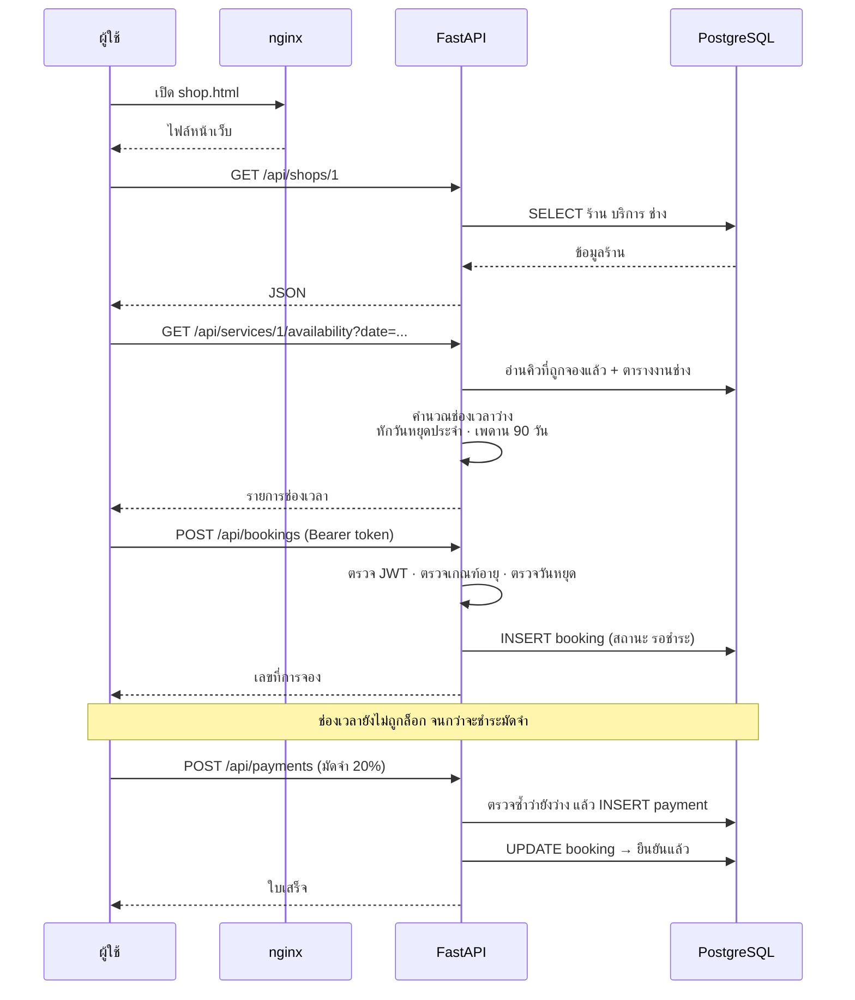
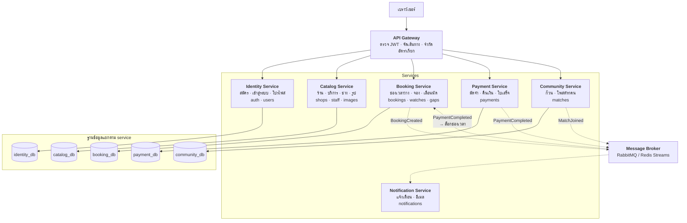

# สถาปัตยกรรมระบบ Bookvice

> เอกสารนี้อธิบายสถาปัตยกรรมที่ระบบ **เป็นอยู่จริง** ก่อน แล้วจึงเสนอแนวทาง
> แยกเป็น microservices พร้อมเหตุผลว่าทำไมตอนนี้ยังไม่ได้แยก

---

## 1. สรุปใน 30 วินาที

Bookvice เป็น **modular monolith** — แอปพลิเคชันเดียวที่แบ่งโค้ดภายในเป็นโมดูล
ตามขอบเขตธุรกิจไว้ชัดเจน รันด้วย Docker Compose 4 container

| ตัวเลขจากโค้ดจริง | ค่า |
|---|---|
| REST endpoint | 86 |
| ตารางฐานข้อมูล | 19 |
| โมดูล (router) | 12 |
| หน้าเว็บ | 20 |
| ชุดทดสอบอัตโนมัติ | 143 ข้อ (API 121 · ตรรกะหน้าเว็บ 22) |

---

## 2. สถาปัตยกรรมที่ใช้งานจริง

**จุดที่ควรสังเกต** — เบราว์เซอร์เรียก Overpass และ OpenStreetMap **โดยตรง**
ไม่ผ่านเซิร์ฟเวอร์เรา เพราะโฮสต์ที่ใช้เป็นแพ็กเกจฟรีที่ตื่นช้าอยู่แล้ว
การให้มันเป็นตัวกลางอีกทอดจะทำให้ช้าลงโดยไม่ได้อะไรกลับมา

---

## 3. โครงภายในของ api container

`aliases.py` ไม่มี endpoint เป็นของตัวเอง — เป็นเส้นทางลัดที่ผูกกลับไปฟังก์ชันเดิม
เพื่อให้ URL ตรงกับรูปแบบที่โจทย์กำหนด โดยไม่ต้องเขียนตรรกะซ้ำสองชุด

---

## 4. ลำดับการทำงาน — ตัวอย่างการจองหนึ่งครั้ง

---

## 5. ทำไมตอนนี้ยังเป็น monolith

การแยก microservices มีต้นทุนที่ต้องจ่ายก่อนได้ประโยชน์

| ต้นทุน | ผลกับโปรเจกต์นี้ |
|---|---|
| ธุรกรรมข้ามฐานข้อมูล | การจอง + การชำระเงินต้องอยู่ในธุรกรรมเดียวกัน ถ้าแยกฐานข้อมูลต้องทำ Saga pattern เอง |
| เครือข่ายระหว่าง service | เรียกในหน่วยความจำใช้เวลาระดับไมโครวินาที ข้ามเครือข่ายเป็นมิลลิวินาที และล้มเหลวได้ |
| จำนวน container | จาก 4 เป็น 10+ บนโฮสต์ฟรีที่ให้ container เดียว |
| การดูแล | ต้องมี service discovery · API gateway · distributed tracing |

**เกณฑ์ที่ใช้ตัดสิน** — ระบบนี้มีผู้ใช้หลักสิบ ทีมพัฒนาคนเดียว และ deploy พร้อมกันทั้งก้อน
ทั้งสามข้อคือเงื่อนไขที่ monolith เหมาะกว่า microservices

> แนวคิดนี้ตรงกับที่ Netflix อธิบายไว้ — Netflix แยก microservices เพราะมีผู้ใช้
> ระดับร้อยล้านและทีมหลายร้อยทีมที่ต้อง deploy อิสระจากกัน ไม่ใช่เพราะ microservices
> ดีกว่าโดยตัวมันเอง

**แต่โค้ดถูกวางไว้ให้แยกได้** — แต่ละโมดูลใน `routers/` มีขอบเขตข้อมูลของตัวเอง
และไม่เรียกฟังก์ชันข้ามโมดูลกันตรง ๆ ทำให้แยกออกมาได้โดยไม่ต้องรื้อ

---

## 6. แผนแยกเป็น microservices (ถ้าระบบโตขึ้น)

### ขอบเขตของแต่ละ service มาจากไหน

แบ่งตาม **สิ่งที่เปลี่ยนแปลงด้วยเหตุผลเดียวกัน** ไม่ใช่แบ่งตามตาราง

| Service | ตารางที่เป็นเจ้าของ | เหตุผลที่แยกเป็นก้อนนี้ |
|---|---|---|
| Identity | users · token_blacklist · password_reset_tokens · app_secrets | ทุก service ต้องใช้ แต่ไม่มี service ไหนแก้ |
| Catalog | shops · services · staff · categories · shop_images · shop_closures · favorites | อ่านบ่อยมาก เขียนน้อย เหมาะกับการทำแคชแยก |
| Booking | bookings · slot_watches | ตรรกะซับซ้อนที่สุดและเปลี่ยนบ่อยที่สุด |
| Payment | payments | ต้องแยกเพื่อความปลอดภัยและการตรวจสอบย้อนหลัง |
| Community | match_requests · match_joins · match_interests | ฟีเจอร์เสริม ล่มแล้วการจองยังทำงานได้ |
| Notification | notifications | ไม่มีใครเรียกตรง ๆ รับ event อย่างเดียว |

### ปัญหาที่ต้องแก้ตอนแยก

1. **การจองกับการชำระเงินต้องสอดคล้องกัน**
   ปัจจุบันอยู่ในธุรกรรมเดียวกันของ PostgreSQL เมื่อแยกแล้วต้องใช้ Saga —
   Payment Service ยิง event `PaymentCompleted` แล้ว Booking Service ค่อยล็อกช่องเวลา
   ถ้าล็อกไม่สำเร็จต้องยิง `RefundRequested` กลับ

2. **หน้าจองต้องใช้ข้อมูลจากสาม service**
   ร้าน (Catalog) + ช่องเวลา (Booking) + สถานะชำระเงิน (Payment)
   แก้ด้วย API Gateway ที่รวมผลลัพธ์ หรือทำ Backend-for-Frontend

3. **ข้อมูลที่ใช้ร่วมกัน**
   Booking Service ต้องรู้ชื่อร้าน — ไม่ควรเรียก Catalog ทุกครั้ง
   ใช้วิธีคัดลอกเฉพาะฟิลด์ที่ต้องใช้มาเก็บไว้ แล้วอัปเดตเมื่อได้รับ event

---

## 7. ข้อมูลอ้างอิงประกอบ

- Netflix — [10 things you can learn from Netflix's architecture](https://dev.to/somadevtoo/10-things-you-can-learn-from-netflixs-architecture-1bnn)
- Martin Fowler — [MonolithFirst](https://martinfowler.com/bliki/MonolithFirst.html)
