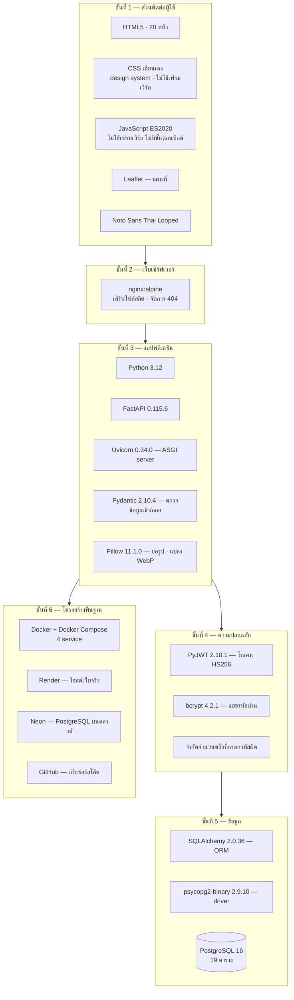

# Technology Stack — Bookvice

เวอร์ชันทั้งหมดในเอกสารนี้อ่านจาก `requirements.txt` และ `docker-compose.yml` ของจริง

---

## แผนผังรวม



---

## รายการแยกตามชั้น

### ส่วนติดต่อผู้ใช้

| เทคโนโลยี | เวอร์ชัน | ใช้ทำอะไร |
|---|---|---|
| HTML5 | — | 20 หน้า แยกไฟล์ตามหน้าที่ ไม่ใช่ SPA |
| CSS | — | ระบบดีไซน์เขียนเองทั้งหมดใน `app.css` ตัวแปรสี ขนาดตัวอักษร ระยะห่าง |
| JavaScript | ES2020 | ไม่ใช้เฟรมเวิร์กและไม่มีขั้นตอนบิลด์ แก้ไฟล์แล้วรีเฟรชเห็นผลทันที |
| Leaflet | 1.9 (CDN) | แผนที่แสดงตำแหน่งร้านและให้เจ้าของร้านปักหมุด |
| Noto Sans Thai Looped | — | ฟอนต์ไทยแบบมีหัว โหลดจาก Google Fonts |

**เหตุผลที่ไม่ใช้ React/Vue** — ระบบนี้เป็นหลายหน้าแยกจากกัน ไม่ได้แชร์สถานะข้ามหน้า
การใส่เฟรมเวิร์กจะเพิ่มขั้นตอนบิลด์และขนาดไฟล์โดยไม่ได้แก้ปัญหาที่มีอยู่จริง

### แอปพลิเคชัน

| เทคโนโลยี | เวอร์ชัน | ใช้ทำอะไร |
|---|---|---|
| Python | 3.12-slim | ภาษาหลักฝั่งเซิร์ฟเวอร์ |
| FastAPI | 0.115.6 | เฟรมเวิร์ก REST API · สร้างเอกสาร Swagger อัตโนมัติที่ `/docs` |
| Uvicorn | 0.34.0 | ASGI server |
| Pydantic | 2.10.4 | ตรวจข้อมูลเข้า/ออกทุกเส้นทาง · ตัวตรวจที่เขียนเองสำหรับเบอร์โทร พิกัด วันเกิด |
| pydantic-settings | 2.7.0 | อ่านค่าตั้งค่าจาก environment variable |
| Pillow | 11.1.0 | ย่อรูปที่อัปโหลด แปลงเป็น WebP และล้างข้อมูลแฝงในไฟล์ |
| python-multipart | 0.0.20 | รับไฟล์อัปโหลดผ่านฟอร์ม |
| email-validator | 2.2.0 | ตรวจรูปแบบอีเมลตอนสมัคร |

### ความปลอดภัย

| เทคโนโลยี | เวอร์ชัน | ใช้ทำอะไร |
|---|---|---|
| PyJWT | 2.10.1 | โทเคน HS256 มีวันหมดอายุ · มีบัญชีดำเมื่อออกจากระบบ |
| bcrypt | 4.2.1 | แฮชรหัสผ่านพร้อมค่าสุ่มประจำบัญชี |
| — | — | จำกัดจำนวนครั้งที่กรอกรหัสผิด 8 ครั้งต่อ 5 นาที ต่อคู่ (ชื่อผู้ใช้ + ไอพี) |
| — | — | กุญแจ JWT เก็บถาวรในตาราง `app_secrets` เพื่อไม่ให้ผู้ใช้หลุดตอนเซิร์ฟเวอร์ตื่น |

### ข้อมูล

| เทคโนโลยี | เวอร์ชัน | ใช้ทำอะไร |
|---|---|---|
| PostgreSQL | 16-alpine | ฐานข้อมูลหลัก 19 ตาราง |
| SQLAlchemy | 2.0.36 | ORM แบบ declarative พร้อม type hint |
| psycopg2-binary | 2.9.10 | ตัวเชื่อมต่อ PostgreSQL |

### โครงสร้างพื้นฐานและการนำขึ้นใช้งาน

| เทคโนโลยี | ใช้ทำอะไร |
|---|---|
| Docker + Docker Compose | 4 service — `db` · `api` · `web` · `pgadmin` |
| Render | โฮสต์เว็บจริง (แพ็กเกจฟรี — เซิร์ฟเวอร์หลับเมื่อไม่มีผู้ใช้) |
| Neon | PostgreSQL บนคลาวด์สำหรับเว็บจริง |
| GitHub | เก็บซอร์สโค้ด |
| pgAdmin 4 | ดูและแก้ข้อมูลระหว่างพัฒนา |

### บริการภายนอก

| บริการ | เรียกจากไหน | ใช้ทำอะไร |
|---|---|---|
| OpenStreetMap | เบราว์เซอร์ | ภาพแผนที่ |
| Overpass API | เบราว์เซอร์ | ค้นหาร้านกาแฟและร้านอาหารรอบร้าน สำหรับส่วน "ระหว่างรอ" |
| Google Fonts | เบราว์เซอร์ | ไฟล์ฟอนต์ |
| Resend | เซิร์ฟเวอร์ | ส่งอีเมลลิงก์ตั้งรหัสผ่านใหม่ |

### การทดสอบ

| เทคโนโลยี | เวอร์ชัน | ใช้ทำอะไร |
|---|---|---|
| httpx | 0.28.1 | ตัวที่ FastAPI TestClient ใช้ยิงคำขอเข้า API |
| SQLite | (มากับ Python) | ฐานข้อมูลชั่วคราวระหว่างทดสอบ ไม่แตะฐานข้อมูลจริง |
| Node.js | 20-alpine | รันชุดทดสอบตรรกะเวลาเปิด-ปิดร้านของฝั่งหน้าเว็บ |

รวม **143 ข้อ** — API 121 ข้อ · ตรรกะหน้าเว็บ 22 ข้อ

```bash
docker compose exec api python tests/test_booking_payment.py
docker run --rm -v "${PWD}:/app" -w /app node:20-alpine node tests/test_shop_status.js
```
